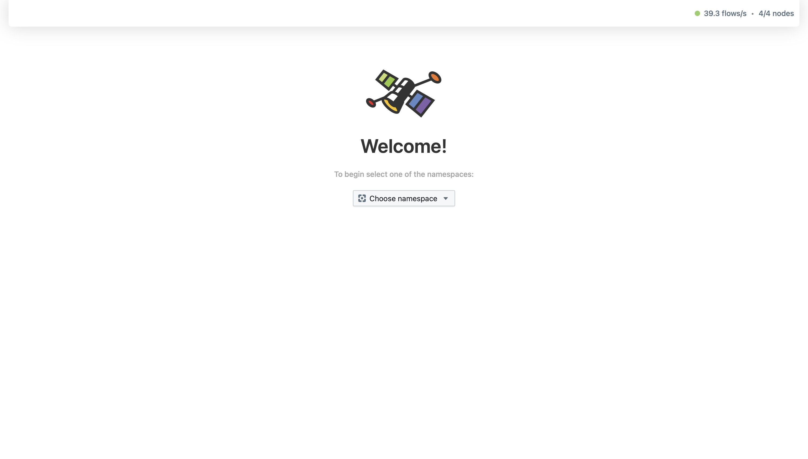
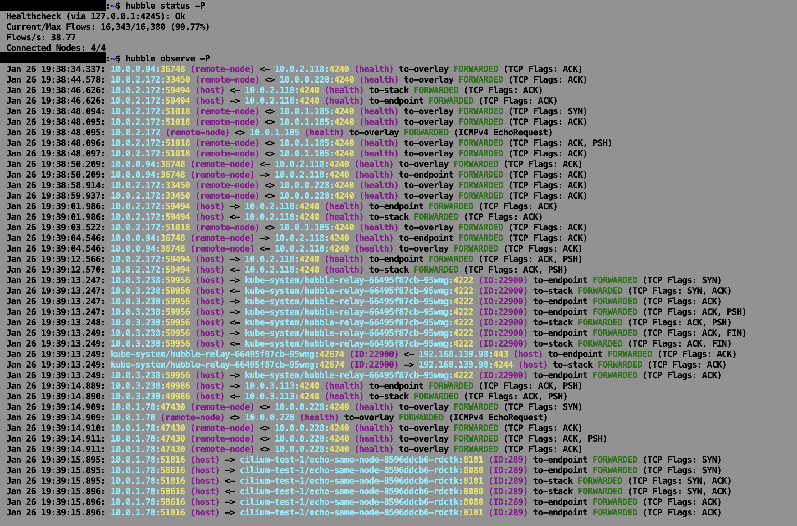

## Phase 1 - Cluster Creation

- 01-30-2026 Labeled worker nodes with targeted roles; verified all nodes in Ready state via kubectl get nodes.
  
- 01-30-2026 Injected Cilium CNI; executed connectivity suite to validate cross-node pod communication.
  
- 01-30-2026 Initialized Hubble; verified observability agent health and API responsiveness.
  
- 01-30-2026 Established port-forwarding from control plane; validated Hubble UX accessibility via local host.
  
- 01-30-2026 Verified gRPC/HTTP traffic flow and validated API query-availability for external monitoring.
  
- 01-30-2026 Traced and audited east-west traffic in Hubble UX; confirmed identity-based policy enforcement.
  

**Summary:** Automated provisioning of 4-node cluster with Cilium/Hubble; verified zero-loss L7 observability for east-west traffic.