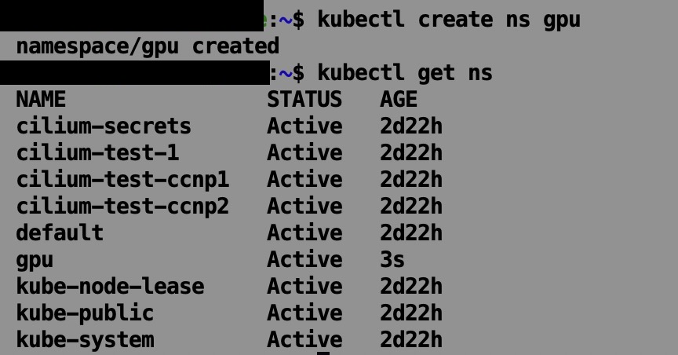
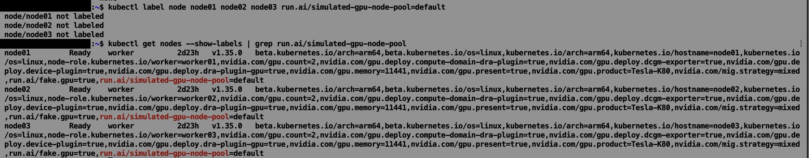
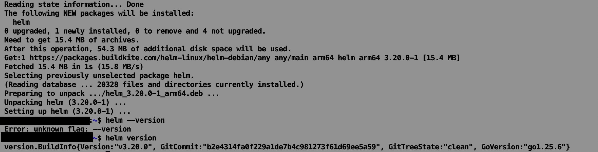
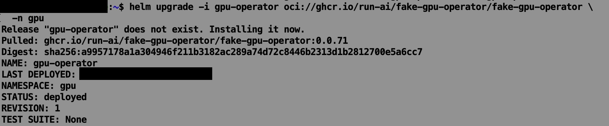
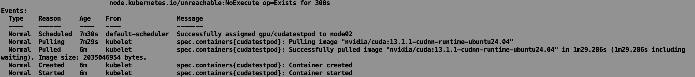
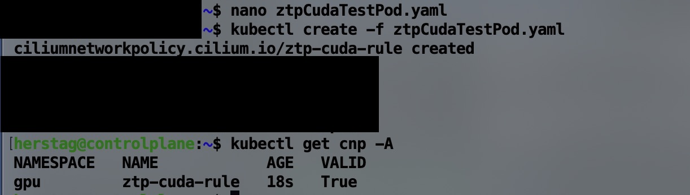
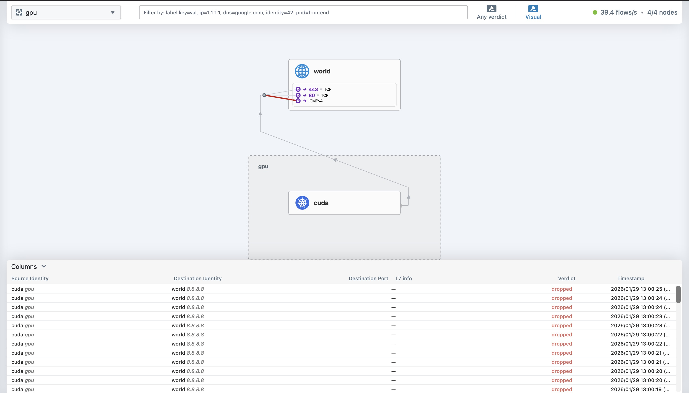

## Phase 2 - H100 GPU Cluster Simulation

- 01-30-2026 Initialized dedicated GPU namespace on the control plane; verified resource isolation and quota readiness.
  
- 01-30-2026 Applied targeted node labels for GPU scheduling; confirmed inventory metadata synchronization across all worker nodes.
  
- 01-30-2026 Deployed Helm v3 and verified chart repository connectivity for the GPU operator stack.
  
- 01-30-2026 Installed Run:ai fake-gpu-operator from GHCR; validated operator pod health and device-plugin registration.
  
- 01-30-2026 Executed cudatestpod deployment; audited pod event logs to confirm successful image pull and container runtime initialization.
  
- 01-30-2026 Performed stress-test scheduling; verified expected pod failure state when requesting resources exceeding the simulated cluster capacity.
  
- 01-30-2026 Injected Cilium Network Zero-Trust Policy; validated policy enforcement status as True via Cilium CLI.
  
- 01-30-2026 Conducted egress security audit; verified policy-driven packet drops to block data exfiltration and external Command & Control (C2C) traffic.
  

  **Summary:** Provisioned virtual H100 GPU nodes via Run:ai; enforced Zero-Trust (ZTP) egress policies to prevent data exfiltration and C2C communication.