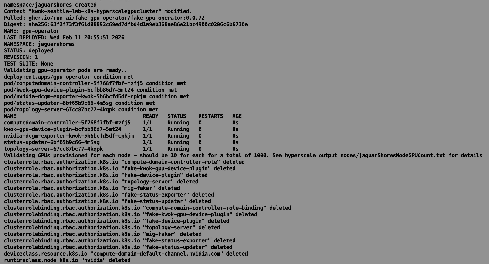
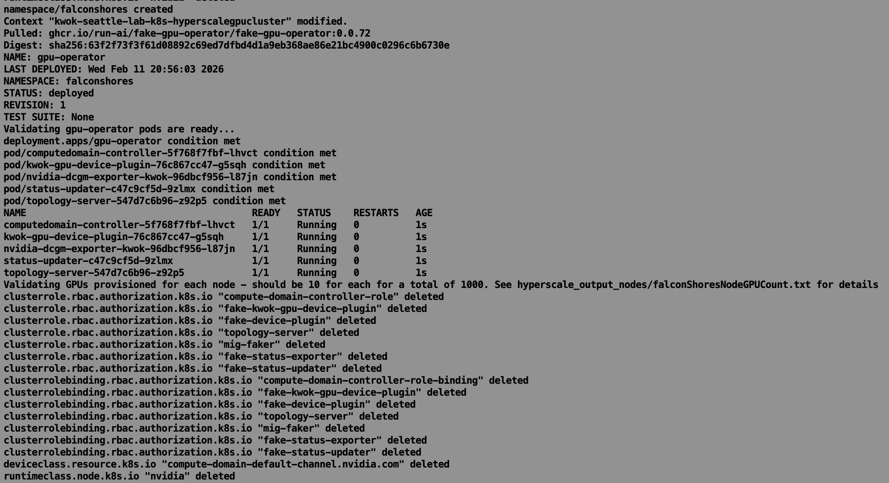
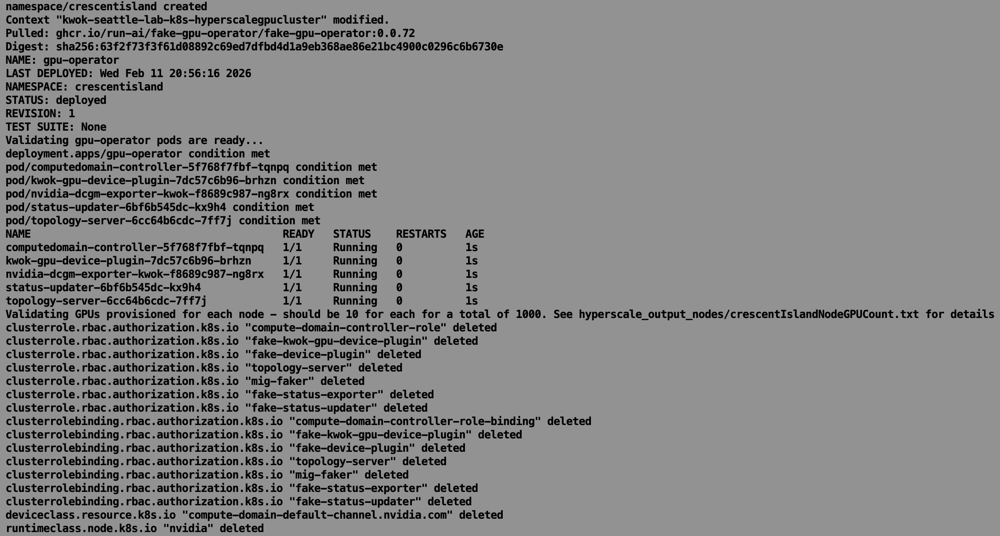
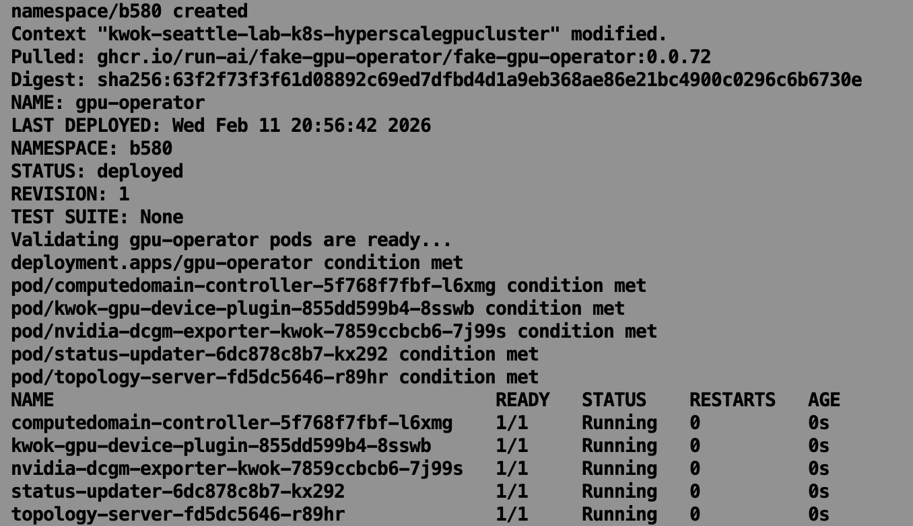
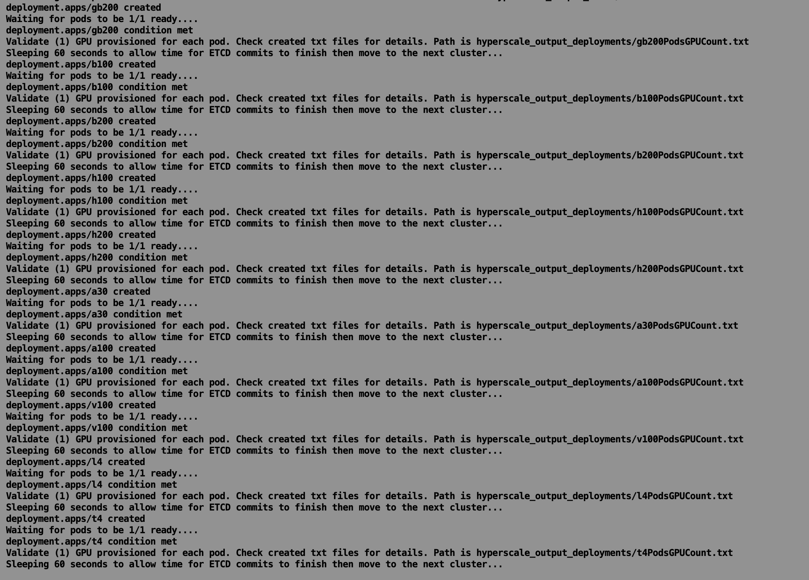
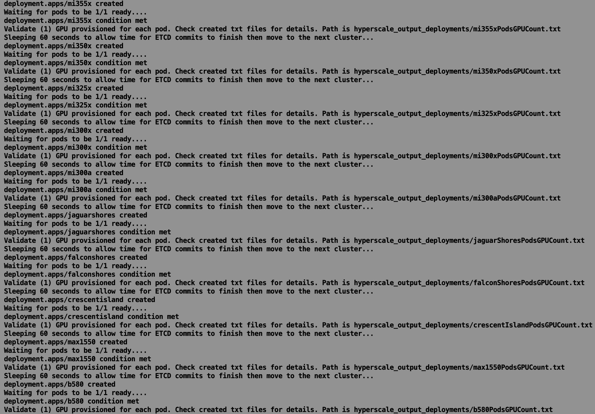
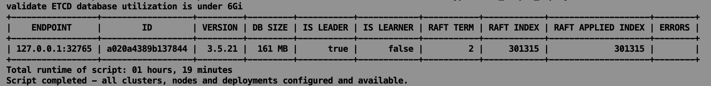

## Phase 3 - Hyperscale GPU Cluster

- 02-11-2026 **Platform Initialization:** Provisioned and right-sized a hardened OrbStack guest environment, optimizing kernel parameters to support a 2,000-node control plane simulation.
  
- 02-11-2026 **Automated Toolchain Orchestration:** Engineered a 714-line master Bash script to automate the deployment of curl, wget, and jq, ensuring a consistent environment for downstream high-concurrency operations.
  
- 02-11-2026 **Cloud-Native Control Plane Bootstrapping:** Automated the full lifecycle of Helm, KWOK, and kubectl; initialized the cluster and generated model-specific manifests for 20 distinct GPU variants.
  
  
- 02-11-2026 **High-Density Fleet Provisioning:** Executed serial node-creation loops for 2,000 worker nodes, implementing custom taints and labels to ensure strict model-specific workload isolation.
  
  
- 02-11-2026 **Operator Convergence & Validation:** Iterated across 20 GPU models (from GB200 to B580) to provision namespaces and validate Running states for the fake-gpu-operator fleet.
  
  
  
  
  
  
  
  
  
  
  
  
  
  
  
  
  
  
  
  
- 02-11-2026 **Workload Orchestration at Scale:** Provisioned and scheduled 20,000 pods across the hyper-cluster; validated scheduler precision and resource mapping via automated .txt receipt generation for every model.
  
  
- 02-11-2026 **Performance Optimization Audit:** Conducted a final etcd utilization audit, confirming a highly optimized 161 MB footprint (well within the 6Gi quota) and calculated total runtime for end-to-end platform hydration.
  

  **Summary:** This phase represents over 40 hours of iterative tuning and debugging. The result is a production-grade, multi-vendor AI simulation that demonstrates Total Ownership of the stack—from kernel-level sysctl modifications to high-level GitOps orchestration.