## Phase 3 - Hyperscale GPU Cluster

- 02-11-2026 Create and right size OrbStack guest.
  
- 02-11-2026 Kick off script, installs curl, wget, jq.
  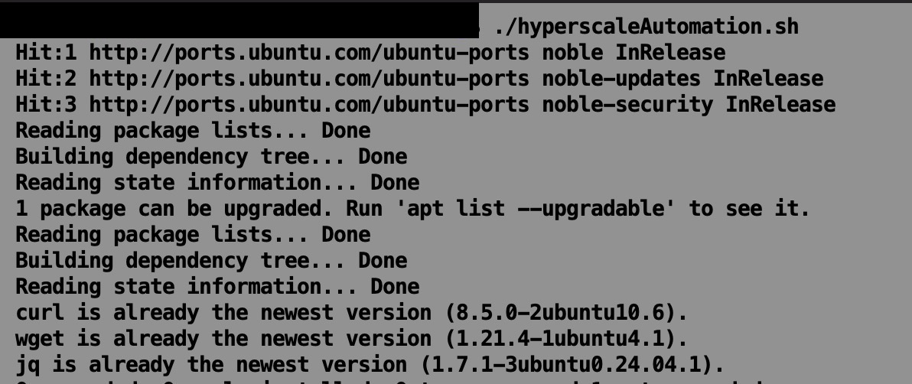
- 02-11-2026 Install Helm, KWOK, KWOKCTL, kubectl, create and start cluster, switch context, output needed manifests and forloop scripts operator will need.
  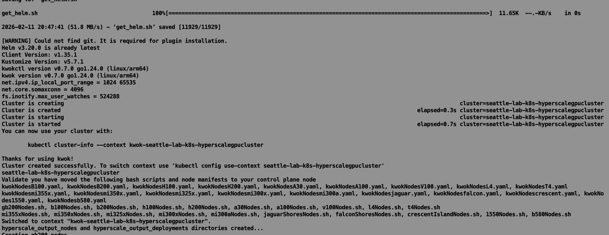
- 02-11-2026 Echo manifests and scripts operator will need to complete the script run.
  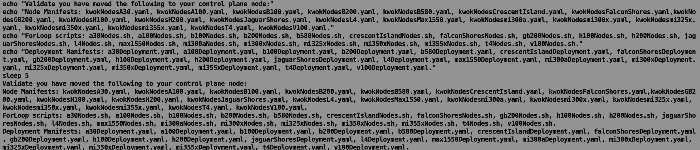
- 02-11-2026 Script loops through forloops to create nodes (1 of 2).
  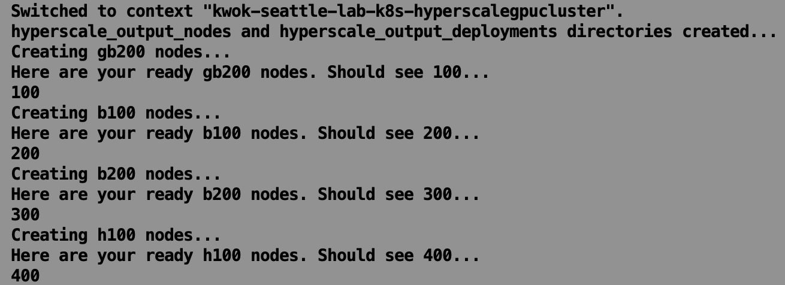
- 02-11-2026 Script loops through forloops to create nodes (2 of 2).
  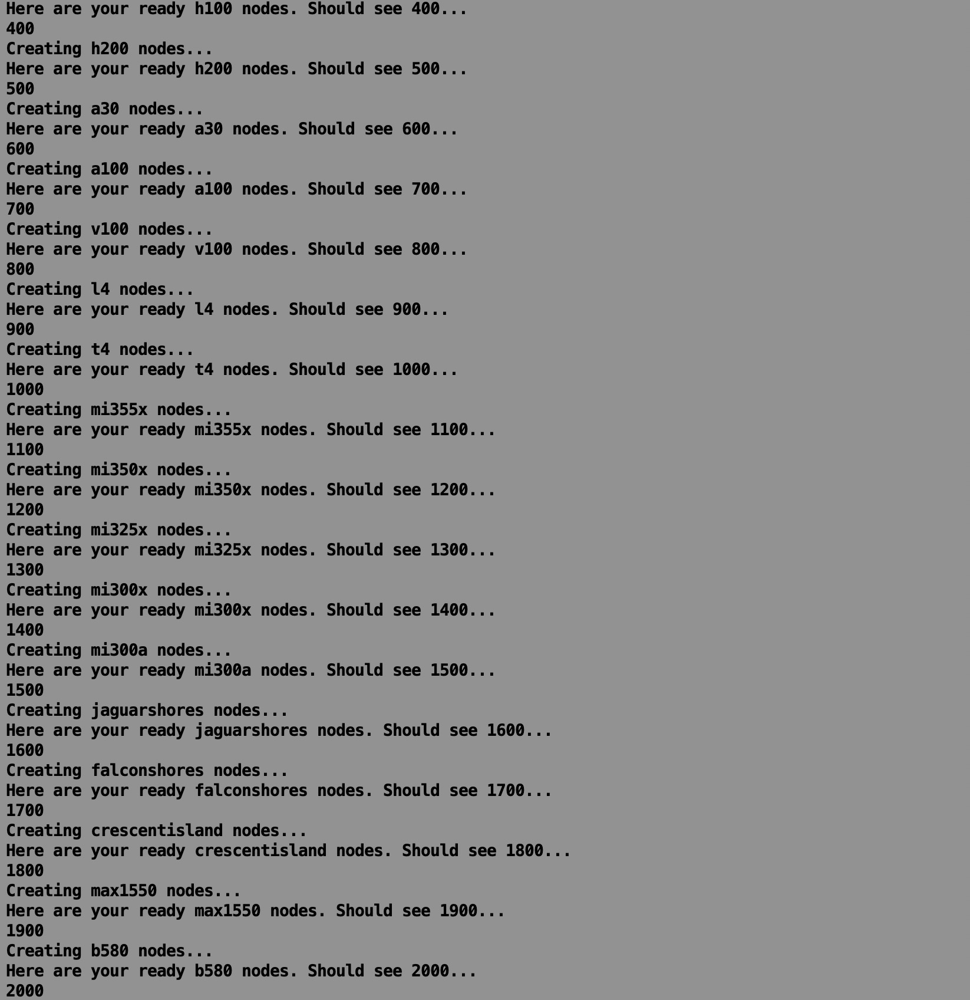
- 02-11-2026 GB200 GPU-Operator pods and namespace creation.
  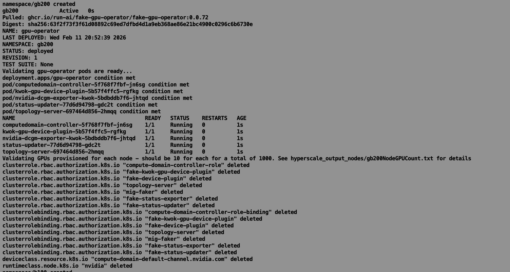
- 02-11-2026 B100 GPU-Operator pods and namespace creation.
  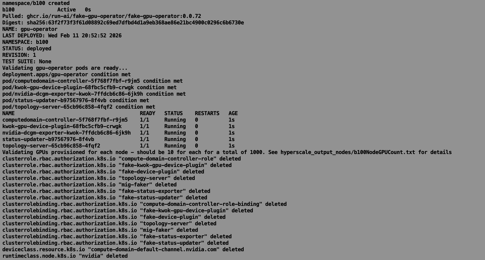
- 02-11-2026 B200 GPU-Operator pods and namespace creation.
  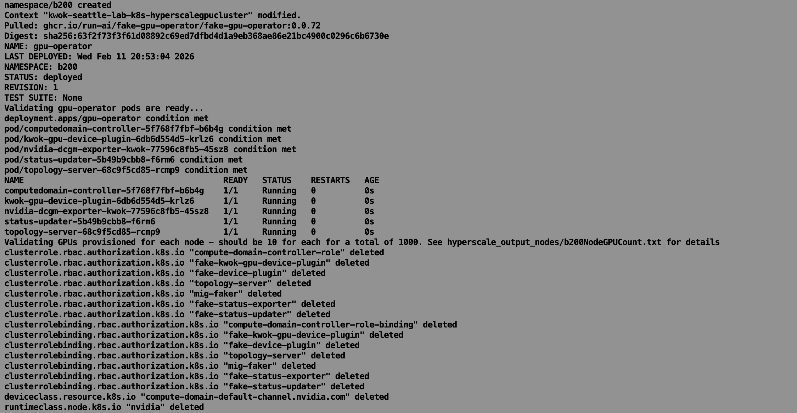
- 02-11-2026 H100 GPU-Operator pods and namespace creation.
  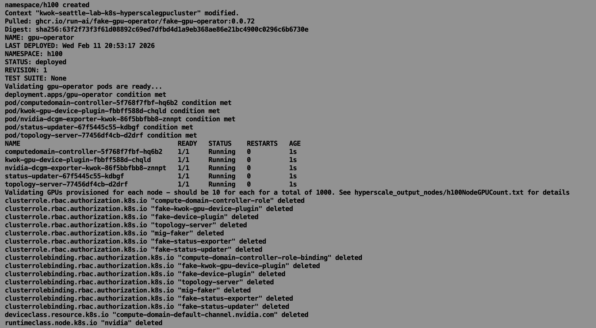
- 02-11-2026 H200 GPU-Operator pods and namespace creation.
  
- 02-11-2026 A30 GPU-Operator pods and namespace creation.
  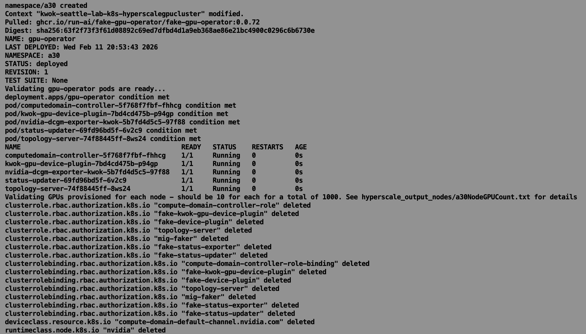
- 02-11-2026 V100 GPU-Operator pods and namespace creation.
  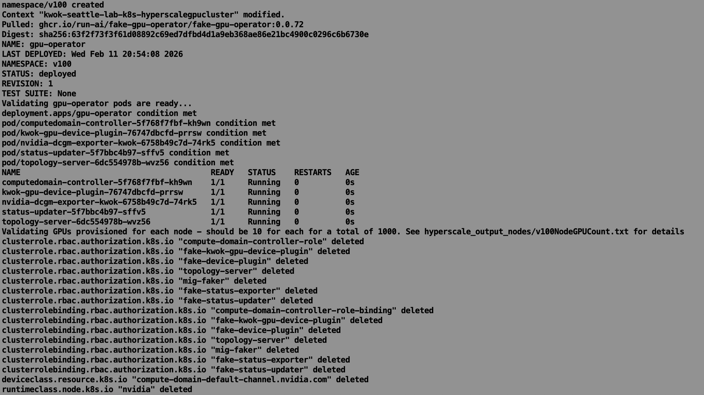
- 02-11-2026 L4 GPU-Operator pods and namespace creation.
  
- 02-11-2026 T4 GPU-Operator pods and namespace creation.
  
- 02-11-2026 MI355X GPU-Operator pods and namespace creation.
  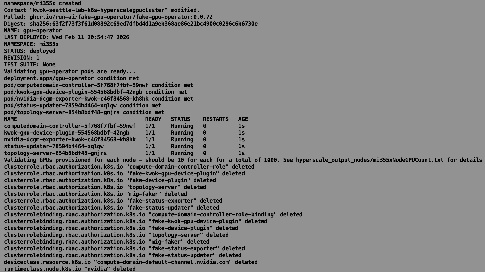
- 02-11-2026 MI350X GPU-Operator pods and namespace creation.
  
- 02-11-2026 MI325X GPU-Operator pods and namespace creation.
  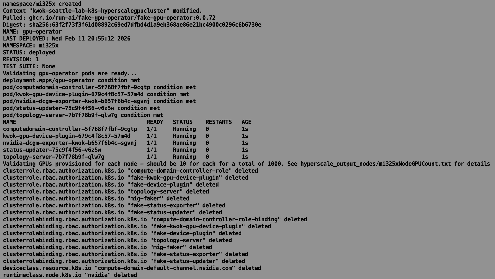
- 02-11-2026 A100 GPU-Operator pods and namespace creation.
  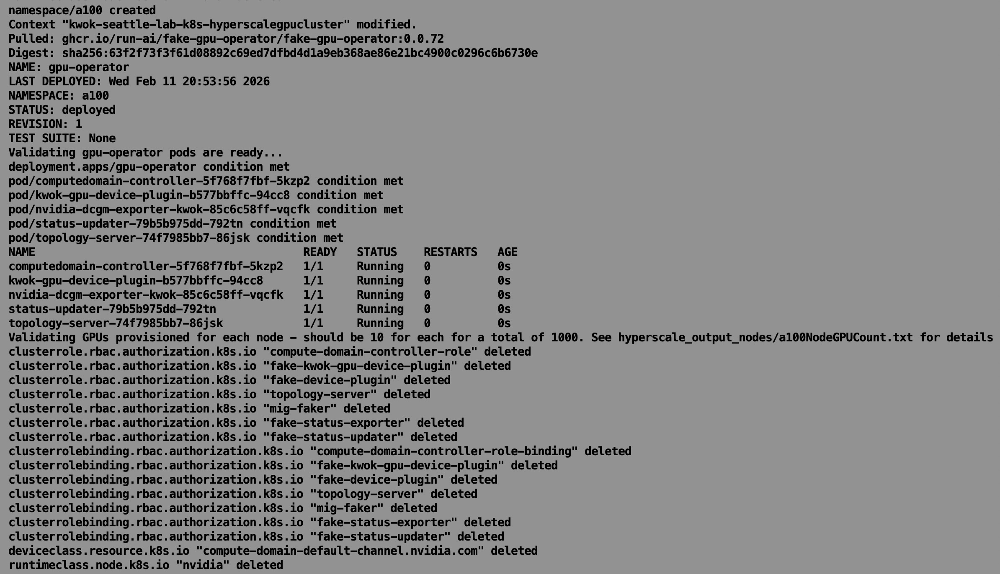
- 02-11-2026 MI300X GPU-Operator pods and namespace creation.
  
- 02-11-2026 MI300A GPU-Operator pods and namespace creation.
  

  **Summary:** 