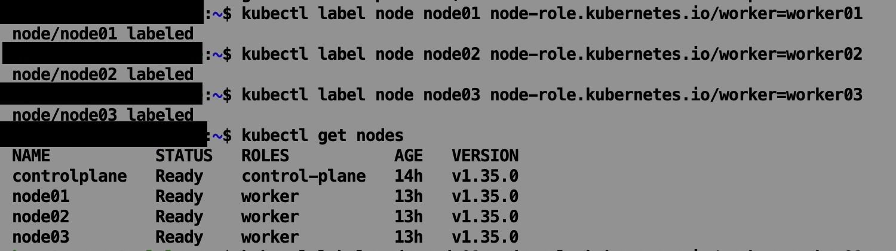
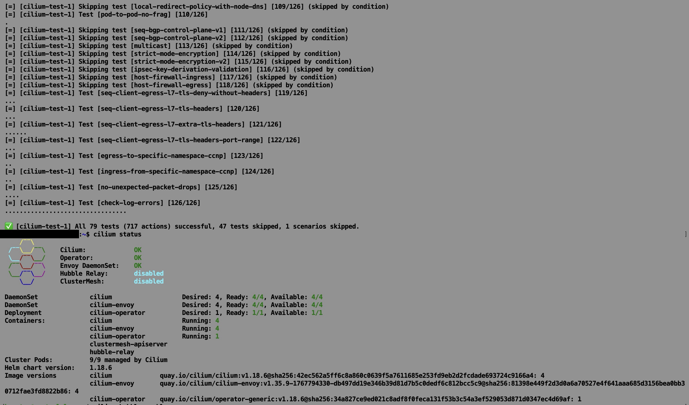
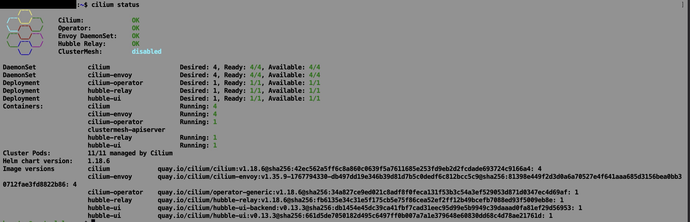

## Phase 1 - Cluster Creation
**Summary:** Automated provisioning of four node cluster, cilium, hubble

- 2026-01-30 Label all worker nodes with role then validate all nodes in the cluster are joined and ready.
  
- 2026-01-30 Install Cilium - Run and validate tests validate status
  
- 2026-01-30 Validate Hubble install and UX readiness.
  
- 2026-01-30 Validate UX comes up and is accessible once port forwarding is enabled from the controlplane node.
  
- 2026-01-30 Validate traffic flows and api query-availability.
  
- 2026-01-30 Validate can trace east west traffic in UX.
  
